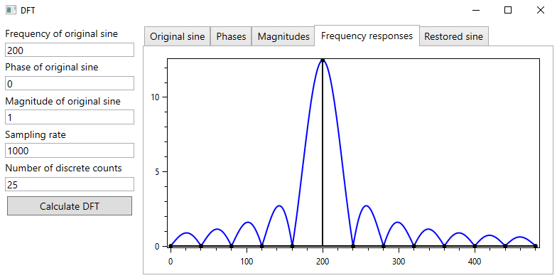
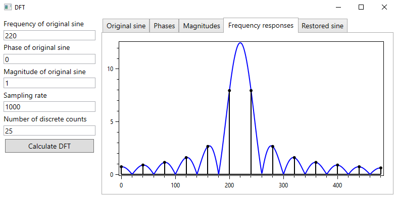

# Discrete Fourier Transform (DFT)
This WPF app allows to perform DFT algorithm on discrete counts of sine wave with given phase, magnitude and frequency.  

App is created for spectrum leakage effect demonstation. Simply put, such effect occurs when the signal being measured is not periodic in the sample interval. That happens because DFT returns correct answer only when the input data sequence contains energy right on frequency that is multiple of fundamental frequency: Fs/N, where Fs - sampling rate, N - number of discrete counts.
## Demonstration:

## Dependencies:
* [OxyPlot](https://github.com/oxyplot/oxyplot)
